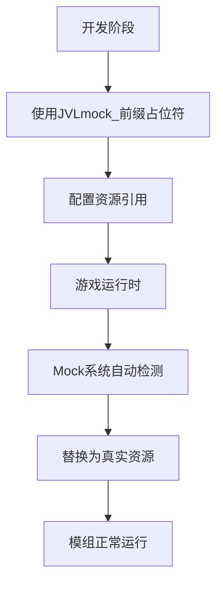

<div align="center">

# 🐱 ValheimCatManager

### ⚡ 下一代Valheim模组开发框架 | 让模组开发变得简单而强大

[](https://github.com/yourusername/ValheimCatManager)
[](LICENSE)
[](https://store.steampowered.com/app/892970/Valheim/)
[](https://dotnet.microsoft.com/)
[](https://github.com/BepInEx/BepInEx)

[](https://github.com/yourusername/ValheimCatManager)
[](https://github.com/yourusername/ValheimCatManager/fork)

---

### 🚀 **零基础也能轻松上手** | **让模组开发像搭积木一样简单**

</div>

---

## 📋 目录

- [🌟 项目简介](#-项目简介)
- [✨ 核心特性](#-核心特性)
- [🛠️ 快速开始](#️-快速开始)
- [📚 详细使用指南](#-详细使用指南)
- [🎯 Mock系统](#-mock系统)
- [🔧 配置选项](#-配置选项)
- [📖 API参考](#-api参考)
- [🤝 贡献指南](#-贡献指南)
- [📄 许可证](#-许可证)

---

## 🌟 项目简介

**ValheimCatManager** 是一个专为Valheim模组开发者设计的资源管理框架。它采用最新的.NET技术栈，提供了一套完整、直观的API，让您能够轻松管理游戏中的各种资源和配置。

### 🎯 为什么选择ValheimCatManager？

- **🎨 零学习成本** - 中文API设计，即使没有编程经验也能快速上手
- **⚡ 高性能** - 基于AssetBundle的资源加载，内存占用极低
- **🔧 高度可配置** - 支持植被、物品、建筑、怪物等全方位的游戏内容定制
- **🛡️ 稳定可靠** - 内置Mock系统，确保模组兼容性和稳定性
- **📱 现代化** - 采用2025年最新的开发理念和技术栈

---

## ✨ 核心特性

### 🎮 游戏内容管理
- **🏗️ 物品系统** - 轻松添加自定义物品、武器、工具
- **🌱 植被系统** - 智能植被生成，支持复杂的地形和生态配置
- **🏠 建筑系统** - 完整的Piece物件管理，支持制作配方和材料需求
- **👹 怪物系统** - 自定义怪物AI、掉落物、生成规则
- **🍳 烹饪系统** - 烹饪站和炼制站的完整配置支持

### 🔧 开发工具
- **📦 资源包管理** - 自动化的AssetBundle加载和管理
- **🎭 Mock系统** - 智能占位符替换，确保模组兼容性
- **⚙️ 配置系统** - 类型安全的配置类，支持智能提示
- **🔄 热重载** - 开发时支持资源热重载，提高开发效率

### 🚀 性能优化
- **💾 内存优化** - 智能缓存机制，减少内存占用
- **⚡ 加载优化** - 异步资源加载，不阻塞游戏主线程
- **🔍 错误处理** - 完善的错误检测和日志系统

---

## 🛠️ 快速开始

### 📋 前置要求

- **Valheim** 游戏本体
- **BepInEx 5.4.21+** 模组加载器
- **Visual Studio 2022** 或 **JetBrains Rider** (推荐)
- **.NET 4.8.1** 开发环境

### ⚡ 5分钟快速上手

#### 1️⃣ 创建新项目

```csharp
using BepInEx;
using ValheimCatManager.Tool;

[BepInPlugin("com.yourname.yourmod", "你的模组名", "1.0.0")]
public class YourModPlugin : BaseUnityPlugin
{
    public void Awake()
    {
        // 🎯 加载资源包
        CatResModManager.Instance.LoadAssetBundle("你的资源包名");
        
        // 🎮 添加物品
        CatResModManager.Instance.AddItem("你的物品名", true);
        
        // 🌱 添加植被
        CatResModManager.Instance.AddVegetation(new VegetationConfig("覆盆子")
        {
            生态区域 = "Meadows",
            最小_数量 = 5,
            最大_数量 = 10
        }, true);
    }
}
```

#### 2️⃣ 配置资源包

1. 在项目中创建 `Asset` 文件夹
2. 将Unity导出的AssetBundle文件放入
3. 设置文件属性为"嵌入式资源"
4. 在代码中调用 `LoadAssetBundle("文件名")`

#### 3️⃣ 运行测试

```bash
# 编译项目
dotnet build

# 自动复制到Valheim插件目录
# 启动游戏测试
```

---

## 📚 详细使用指南

### 🎮 物品管理

#### 添加基础物品

```csharp
// 简单物品添加
CatResModManager.Instance.AddItem("铁剑", true);

// 添加食物（自动配置Piece属性）
CatResModManager.Instance.AddFood("苹果", "蔬菜类", true);
```

#### 添加建筑物件

```csharp
// 创建Piece配置
var pieceConfig = new PieceConfig("木墙", "建筑", "Hammer", 
    ("木材", 2, true),  // 需要2个木材，拆除时返还
    ("铁钉", 1, false)  // 需要1个铁钉，拆除时不返还
);

CatResModManager.Instance.AddPiece(pieceConfig, true);
```

### 🌱 植被系统

#### 基础植被配置

```csharp
// 方式1：分步配置
var vegetationConfig = new VegetationConfig("橡树");
vegetationConfig.生态区域 = "BlackForest";
vegetationConfig.区域范围 = Heightmap.BiomeArea.Everything;
vegetationConfig.最小_数量 = 2;
vegetationConfig.最大_数量 = 5;
vegetationConfig.最小_缩放 = 0.8f;
vegetationConfig.最大_缩放 = 1.2f;
CatResModManager.Instance.AddVegetation(vegetationConfig, true);

// 方式2：链式配置
CatResModManager.Instance.AddVegetation(new VegetationConfig("覆盆子")
{
    生态区域 = "Meadows",
    区域范围 = Heightmap.BiomeArea.Median,
    最小_数量 = 5,
    最大_数量 = 10,
    清理地面 = true,
    最小倾斜 = 0f,
    最大倾斜 = 15f
}, true);
```

#### 高级植被配置

```csharp
// 复杂地形植被
var mountainVegetation = new VegetationConfig("松树")
{
    生态区域 = "Mountain",
    区域范围 = Heightmap.BiomeArea.Everything,
    最小_数量 = 3,
    最大_数量 = 8,
    最小倾斜 = 20f,        // 只在斜坡上生成
    最大倾斜 = 60f,
    最小_需求高度 = 50f,    // 只在海拔50米以上生成
    最高_需求高度 = 200f,
    掩码检查 = true,        // 启用植被掩码检查
    掩码检查距离 = 25f,
    组最小 = 2,             // 成组生成
    组最大 = 4,
    组间距 = 5f
};
CatResModManager.Instance.AddVegetation(mountainVegetation, true);
```

### 👹 怪物系统

```csharp
// 创建怪物配置
var monsterConfig = new MonsterConfig("自定义巨魔")
{
    预制名 = "CustomTroll",
    生命值 = 500f,
    攻击力 = 80f,
    移动速度 = 2.5f,
    食谱 = new string[] { "巨魔皮", "巨魔肉" }
};

CatResModManager.Instance.AddMonster(monsterConfig, true);
```

### 🍳 烹饪和炼制系统

```csharp
// 烹饪站配置
var cookingConfig = new CookingStationConfig("烤肉架", "猪肉", 4);
CatResModManager.Instance.AddCookingStation(cookingConfig);

// 炼制站配置
var smelterConfig = new SmeltersConfig("熔炉", "铁块", "铁锭");
CatResModManager.Instance.AddSmelters(smelterConfig);
```

---

## 🎯 Mock系统

### 🔍 什么是Mock系统？

Mock系统是ValheimCatManager的核心创新功能，它解决了模组开发中最常见的问题：**资源依赖和兼容性**。

### 🎭 工作原理



### 🛠️ 使用方法

#### 1️⃣ 在Unity中设置占位符

```csharp
// 在预制件中，将需要引用的资源命名为：
// JVLmock_真实资源名

// 例如：
// JVLmock_Apple     -> 苹果
// JVLmock_IronSword -> 铁剑
// JVLmock_Stone     -> 石头
```

#### 2️⃣ 在代码中启用Mock

```csharp
// 添加物品时启用Mock
CatResModManager.Instance.AddItem("苹果", true);  // true = 启用Mock

// 添加植被时启用Mock
CatResModManager.Instance.AddVegetation(vegetationConfig, true);

// 添加建筑时启用Mock
CatResModManager.Instance.AddPiece(pieceConfig, true);
```

#### 3️⃣ 自动替换过程

Mock系统会在游戏启动时自动：

1. **🔍 扫描检测** - 查找所有JVLmock_前缀的占位符
2. **📋 收集信息** - 记录占位符的位置和关联关系
3. **🔄 智能替换** - 将占位符替换为真实的游戏资源
4. **✅ 验证完成** - 确保所有引用都正确更新

### 🎯 Mock系统的优势

- **🛡️ 兼容性保证** - 避免资源缺失导致的崩溃
- **⚡ 开发效率** - 无需手动管理复杂的资源依赖
- **🔧 维护简单** - 资源更新时自动处理引用关系
- **🎮 用户体验** - 确保模组在各种环境下都能正常运行

---

## 🔧 配置选项

### 🌱 VegetationConfig 植被配置

| 属性 | 类型 | 默认值 | 说明 |
|------|------|--------|------|
| `预制件` | string | 必填 | 植被预制件名称 |
| `生态区域` | string | "None" | 生成生态区域 |
| `区域范围` | BiomeArea | Everything | 生成区域范围 |
| `最小_数量` | float | 1 | 每区域最小数量 |
| `最大_数量` | float | 1 | 每区域最大数量 |
| `最小_缩放` | float | 1 | 最小缩放比例 |
| `最大_缩放` | float | 1 | 最大缩放比例 |
| `清理地面` | bool | true | 是否清理地面 |
| `最小倾斜` | float | 0 | 最小地形角度 |
| `最大倾斜` | float | 35 | 最大地形角度 |

### 🏗️ PieceConfig 建筑配置

| 属性 | 类型 | 默认值 | 说明 |
|------|------|--------|------|
| `预制件` | string | 必填 | 建筑预制件名称 |
| `制作工具` | string | "" | 制作所需工具 |
| `目录` | string | "" | 制作菜单分组 |
| `制作材料` | Requirement[] | [] | 制作材料需求 |

### 👹 MonsterConfig 怪物配置

| 属性 | 类型 | 默认值 | 说明 |
|------|------|--------|------|
| `预制名` | string | 必填 | 怪物预制件名称 |
| `生命值` | float | 100 | 怪物生命值 |
| `攻击力` | float | 20 | 怪物攻击力 |
| `移动速度` | float | 1 | 怪物移动速度 |
| `食谱` | string[] | [] | 掉落物品列表 |

---

## 📖 API参考

### 🎮 CatResModManager 核心API

```csharp
public class CatResModManager
{
    // 单例访问
    public static CatResModManager Instance { get; }
    
    // 资源包管理
    public void LoadAssetBundle(string assetName);
    
    // 物品管理
    public void AddItem(string itemName, bool mockCheck);
    public void AddFood(string foodName, string groupName, bool mockCheck);
    
    // 预制件管理
    public void AddPrefab(string prefabName, bool mock);
    
    // 植被管理
    public void AddVegetation(VegetationConfig config, bool mock);
    
    // 建筑管理
    public void AddPiece(PieceConfig config, bool mockCheck);
    
    // 怪物管理
    public void AddMonster(MonsterConfig config, bool mock);
    
    // 生成管理
    public void AddSpawn(SpawnConfig config);
    
    // 烹饪管理
    public void AddCookingStation(CookingStationConfig config);
    
    // 炼制管理
    public void AddSmelters(SmeltersConfig config);
}
```

### 🔧 配置类API

#### VegetationConfig

```csharp
public class VegetationConfig
{
    public VegetationConfig(string name);
    
    // 基础属性
    public string 预制件 { get; set; }
    public string 生态区域 { get; set; }
    public Heightmap.BiomeArea 区域范围 { get; set; }
    public bool 启用 { get; set; }
    
    // 数量控制
    public float 最小_数量 { get; set; }
    public float 最大_数量 { get; set; }
    
    // 外观控制
    public float 最小_缩放 { get; set; }
    public float 最大_缩放 { get; set; }
    public float 随机倾斜 { get; set; }
    
    // 地形控制
    public bool 清理地面 { get; set; }
    public float 最小倾斜 { get; set; }
    public float 最大倾斜 { get; set; }
    public float 最低_需求高度 { get; set; }
    public float 最高_需求高度 { get; set; }
    
    // 高级功能
    public bool 掩码检查 { get; set; }
    public float 掩码检查距离 { get; set; }
    public int 掩码检查层数 { get; set; }
    public bool 森林内生成 { get; set; }
    
    // 组生成
    public int 组最小 { get; set; }
    public int 组最大 { get; set; }
    public float 组间距 { get; set; }
}
```

---

## 🤝 贡献指南

我们欢迎所有形式的贡献！无论是代码、文档、还是想法，都能让ValheimCatManager变得更好。

### 🚀 如何贡献

1. **🍴 Fork** 这个仓库
2. **🌿 创建** 你的特性分支 (`git checkout -b feature/AmazingFeature`)
3. **💾 提交** 你的更改 (`git commit -m 'Add some AmazingFeature'`)
4. **📤 推送** 到分支 (`git push origin feature/AmazingFeature`)
5. **🔄 创建** Pull Request

### 📝 代码规范

- 使用中文注释和变量名
- 遵循C#命名约定
- 添加适当的XML文档注释
- 确保代码通过所有测试

### 🐛 报告问题

如果你发现了bug或有功能建议，请：

1. 检查 [Issues](https://github.com/yourusername/ValheimCatManager/issues) 是否已存在
2. 创建新的Issue，详细描述问题
3. 提供复现步骤和环境信息

---

## 📄 许可证

本项目采用 [MIT许可证](LICENSE) - 查看 LICENSE 文件了解详情。

---

## 🙏 致谢

感谢所有为Valheim模组社区做出贡献的开发者们！

特别感谢：
- **BepInEx团队** - 提供了强大的模组加载框架
- **Valheim开发团队** - 创造了这个精彩的游戏
- **所有贡献者** - 让这个项目变得更好

---

<div align="center">

### ⭐ 如果这个项目对你有帮助，请给我们一个Star！

**让模组开发变得简单而强大** 🚀

[](https://github.com/yourusername/ValheimCatManager)
[](https://github.com/yourusername/ValheimCatManager/fork)

---

**Made with ❤️ by ValheimCatManager Team**

</div>
